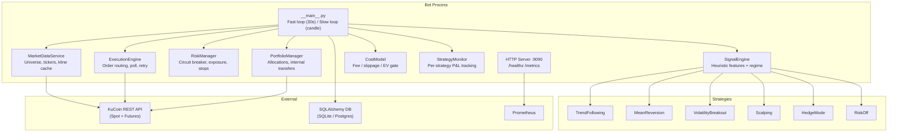
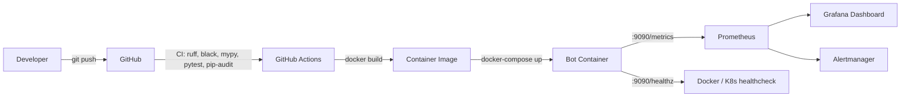

# Architecture

> **Disclaimer**: This bot trades real money. Profitability is NOT guaranteed.
> This is NOT financial advice.

## System Overview

## Deployment Flow

## Components

| Component | File(s) | Role |
|---|---|---|
| Main Loop | `kucoin_bot/__main__.py` | Fast/slow loop, kill switch, signal→order pipeline |
| Config | `kucoin_bot/config.py` | Env-var-only config, mode resolution |
| KuCoin Client | `kucoin_bot/api/client.py` | REST client with retry, rate-limit handling |
| WebSocket | `kucoin_bot/api/websocket.py` | Real-time market data (optional) |
| MarketDataService | `kucoin_bot/services/market_data.py` | Universe discovery, kline cache |
| SignalEngine | `kucoin_bot/services/signal_engine.py` | Feature computation, regime detection |
| RiskManager | `kucoin_bot/services/risk_manager.py` | Position tracking, circuit breaker, stops |
| ExecutionEngine | `kucoin_bot/services/execution.py` | Order placement, polling, retry, reduceOnly |
| PortfolioManager | `kucoin_bot/services/portfolio.py` | Weight allocation, internal transfers |
| CostModel | `kucoin_bot/services/cost_model.py` | Fee estimation, EV gate |
| SideSelector | `kucoin_bot/services/side_selector.py` | Long/short routing |
| StrategyMonitor | `kucoin_bot/services/strategy_monitor.py` | Per-strategy performance tracking |
| Strategies | `kucoin_bot/strategies/*.py` | Trend, MeanRev, Volatility, Scalping, Hedge, RiskOff |
| Metrics | `kucoin_bot/reporting/metrics.py` | In-process counter/gauge/histogram store |
| HTTP Server | `kucoin_bot/reporting/http_server.py` | /healthz + /metrics endpoints |
| Retention | `kucoin_bot/reporting/retention.py` | TTL-based SignalSnapshot cleanup |
| CLI Dashboard | `kucoin_bot/reporting/cli.py` | Terminal dashboard |
| DB Models | `kucoin_bot/models.py` | Orders, Trades, Signals, PnL, Transfers |
| Backtest | `kucoin_bot/backtest/engine.py` | Historical simulation engine |

## Data Flows

1. **Market Data**: KuCoin REST → MarketDataService (cache) → SignalEngine
2. **Signals**: SignalEngine → Strategies (vote) → PortfolioManager (allocate)
3. **Risk Gate**: RiskManager checks exposure, circuit breaker, EV gate
4. **Execution**: ExecutionEngine → KuCoin REST (order) → poll for fill
5. **Persistence**: Fill results → DB (Orders, Trades); signals → DB (SignalSnapshots)
6. **Observability**: METRICS store → HTTP /metrics → Prometheus → Grafana

## Configuration

All configuration is via environment variables. See `.env.example` for the
complete list. No config files, no CLI flags.

## Third-Party Services

| Service | Usage | Required? |
|---|---|---|
| KuCoin REST API | Market data + order execution | Yes (LIVE/PAPER/SHADOW) |
| PostgreSQL | Production database | Optional (default: SQLite) |
| Redis | Fast state cache | Optional |
| Prometheus | Metrics scraping | Optional |
| Grafana | Dashboards | Optional |
